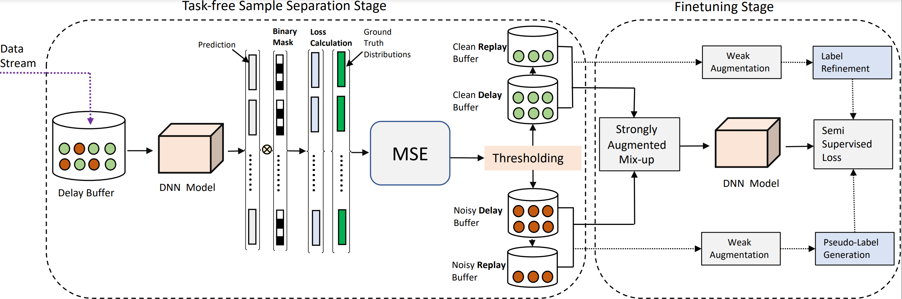

## CNLL: A Semi Supervised Approach for Continual Learning with Noisy Labels  
This repository contains the official PyTorch implementation for our CVPR2022 workshop paper.

## 

## System Dependencies
- Python >= 3.6.1
- CUDA >= 9.0 supported GPU

## Installation
Using virtual env is recommended.
```
$ conda create --name CNLL python=3.6
```
Install pytorch==1.7.0 and torchvision==0.8.1.
Then, install the rest of the requirements.
```
$ pip install -r requirements.txt
```

## Data and Log directory set-up
create `checkpoints` and `data` directories.
We recommend symbolic links as below.

## Run for generating multitask dataset
Specify parameters in `config` yaml, `episodes` yaml files.
```
python main.py --log-dir [log directory path] --c [config file path] --e [episode file path] --override "|" --random_seed [seed]

## To run mnist symmetric noise 40% experiment
python main.py --log-dir [log directory path] --c configs/mnist_spr.yaml --e episodes/mnist-split_epc1_a.yaml --override "corruption_percent=0.4";

## To run cifar10 asymmetric noise 40% experiment
python main.py --log-dir [log directory path] --c configs/cifar10_spr.yaml --e episodes/cifar10-split_epc1_asym_a.yaml --override "asymmetric_noise=True|corruption_percent=0.4";

## To run cifar100 superclass symmetric noise 40% experiment
python main.py --log-dir [log directory path] --c configs/cifar100_spr.yaml --e episodes/cifar100sup-split_epc1_a.yaml --override "superclass_noise=True|corruption_percent=0.4";
```


## For Training 
For continually learning on noisy CIFAR10/CIFAR100-
  python Train_cifar_task.py --noise
For MNIST- 
  python Train_mnist_task.py 

If you find the implementation useful, please cite the paper!
